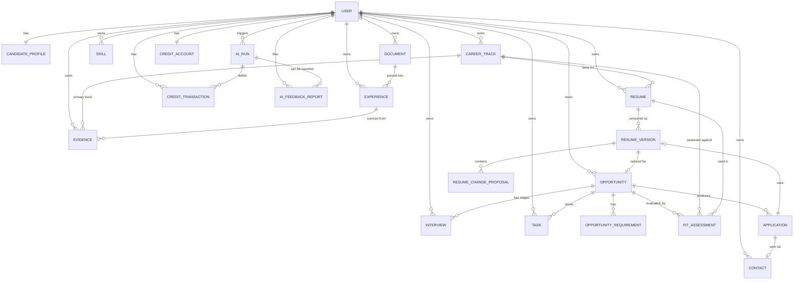

# Career Evidence OS — Product & Technical Plan

## 1. Product Brief

**Core value proposition.** Not another resume builder or job tracker. Career Evidence OS
helps experienced candidates (45+/50+, 15+ years, leadership/expert/consulting profiles)
turn a long, non-linear career into **provable, reusable evidence of business value**, and
match that evidence honestly against specific opportunities — permanent, project, fractional,
or advisory — instead of mass-applying with a generic CV.

**Primary ICP (first cohort).** Russian-speaking senior leaders in General Management,
Operations and Marketing/Commercial: COO, transformation leads, Commercial Director, Head of
BD, CMO, Head of Marketing, Head of Growth, Head of Product — including those exploring
fractional-executive work. Many are also considering international opportunities.

**Secondary ICP.** Career consultants managing multiple experienced clients (not built in MVP,
but the data model must not preclude a future "managed candidate" relationship).

**First paying user.** The candidate themself, self-serve: sign up → onboarding → AI-assisted
extraction → evidence bank → career tracks → resumes → opportunities → fit reports → pipeline.

**North-star metric.** % of activated candidates who, within their first 14 days, have: a
confirmed positioning (≥1 career track marked active), ≥3 evidence cards, ≥2 target
opportunities, and ≥1 completed "quality career action" (accepted resume change applied to a
version, or an outreach draft generated, or an opportunity moved past "Researching").

**Anti-goals (explicit MVP exclusions).** Mass auto-apply; CAPTCHA/auth bypass or scraping
gated content; inventing facts, credentials, or achievements; age-based inference or advice;
full social network or marketplace; interview-copilot/recording; LinkedIn/Gmail/ATS
integrations beyond copy/paste and manual links; native/mobile app; browser extension.

**Monetization (MVP).** Usage-based AI credits. Every LLM-backed action (extraction, fit
report, resume proposal, outreach draft, interview-learning extraction) debits a credit
ledger; no unlimited AI tier in v1. Every AI output surface carries a **"Сообщить об ошибке в
разборе"** control tied to the specific `AiRun`/proposal/dimension.

---

## 2. Architecture Decisions

| Decision | Choice | Why |
|---|---|---|
| Framework | Next.js (latest stable) App Router, TS strict | Server Actions + RSC fit the "server does the AI/validation work" model; one deploy target |
| UI | Tailwind + shadcn/ui + Lucide | Accessible primitives, fast to theme calmly/professionally |
| Forms | React Hook Form + Zod resolvers | Same Zod schemas reused for server validation and AI-output validation |
| Data fetching | RSC + Server Actions by default; TanStack Query only for client-driven async UI (Kanban drag state, diff review, polling AI-run status) | Avoid duplicating Next's own caching where not needed |
| Database | Supabase Postgres — **the same project as an unrelated, pre-existing app**, not a dedicated one | Reusing the project avoids a second paid/free-tier project just for this MVP |
| Schema isolation | All of Career Evidence OS's tables live in a dedicated **`career_os`** Postgres schema (Prisma's `datasource.schemas`), not `public` — the other app keeps `public` to itself | A Supabase project only exposes one Postgres database to Auth/Storage/Studio/the REST API — you cannot get a second isolated *database* without a second project. A separate **schema** is the actual isolation unit available inside one project, and it fully separates the two apps' tables. `career_os` is also not added to Supabase's exposed-schemas list, so it's unreachable through the auto-generated REST/GraphQL API even if that's ever enabled for `public`. |
| Auth | Supabase Auth (email/password + magic link) — **shared with the other app** | Auth (`auth.users`) is project-wide, not per-schema, so this was the one piece that couldn't be isolated by schema alone. Accepted tradeoff: a person signing up on either app gets one shared account/login usable on both. |
| ORM | Prisma | Explicit schema-as-code, strong TS types, easy migrations; team standardizes on one ORM per spec |
| Ownership model | **Enforced in the application layer** (every Server Action/Route Handler scopes queries by `session.user.id`), not solely by Postgres RLS | Prisma connects to Postgres with a privileged role (via Supabase connection pooler) and therefore does not carry the end-user's JWT into row evaluation the way PostgREST/`supabase-js` does. RLS policies are still defined and enabled on every table as defense-in-depth (so a leaked service key or a future direct-`supabase-js` code path fails closed), but the MVP's actual authorization boundary is server-side ownership checks + a shared `withOwnership` query helper. This is documented so it's never silently relied upon as the only guard. |
| Identity bridging | `career_os.users` table mirrors `auth.users` via a Postgres trigger (`on_auth_user_created_career_os`) that inserts `id, email` on every new signup, from either app; `User.id` is a native `uuid` column (not Prisma's default `text`) with an `ON DELETE CASCADE` FK straight to `auth.users.id`, so deleting an auth account cleans up everything under it automatically | Lets Prisma model `User` as a normal foreign-key target without managing the `auth` schema itself. The trigger is named distinctly so it coexists with whatever trigger (if any) the other app has on the same `auth.users` table. The FK requires the native `uuid` type — a plain Prisma `String` id (Postgres `text`) can't be foreign-keyed to a `uuid` column. |
| Migration bookkeeping caveat | Prisma's `_prisma_migrations` table lands in `public` regardless of the `schemas` config, so it is **shared** with the other app's own Prisma history (if it uses Prisma) — confirmed by inspecting the live project. Harmless in practice (it's just a flat list of migration names/checksums, no collision expected), but worth knowing before debugging a "wrong" migration list | `prisma migrate dev`'s "is the database empty" check is also database-wide, not schema-scoped — this project's very first migration had to be hand-baselined (`prisma db execute` + `prisma migrate resolve --applied`) instead of a plain `migrate dev` for exactly this reason. Documented so the next migration doesn't get blocked by the same P3005 surprise. |
| Storage | Supabase Storage, private buckets, signed URLs issued server-side only | Uploaded resumes/CVs must never be publicly reachable by guessed URL |
| AI provider | Provider-abstraction interface `LlmProvider.generateStructured<T>(schema, input)`; **Anthropic (Claude)** as the only concrete implementation in MVP, using tool-use / JSON-schema-constrained output, with the raw result re-validated through the same Zod schema server-side before persistence | Keeps the door open to add OpenAI/other providers later without touching call sites; never trusts the model's own claim of well-formed JSON |
| AI safety | Every AI call goes through one `runAiTask()` helper that: (1) loads only the entity IDs it's allowed to see, (2) injects the shared system-safety preamble (no invented facts, no age inference, cite evidence IDs, null when unknown), (3) validates output with Zod, (4) writes an `AiRun` audit row, (5) debits `CreditAccount`, (6) never persists AI output directly into "verified" fields — only into `..._draft`/proposal tables pending user approval | Central choke point makes the safety rules structural, not a convention every call site has to remember |
| Credits | `CreditAccount` (1:1 per user) + `CreditTransaction` ledger; `runAiTask()` checks balance before calling the LLM and debits atomically in the same DB transaction as the `AiRun` insert | Required by the monetization model (addendum #6); avoids race conditions between two in-flight AI calls |
| AI error reporting | `AiFeedbackReport` table: user-visible "Report an issue" action attachable to any AI-authored artifact (`AiRun`, `ResumeChangeProposal`, a `FitAssessment` dimension, an extracted `Experience`/`Evidence` draft) | Required by addendum #6 as a mandatory UI element everywhere AI output is shown |
| File parsing | DOCX via `mammoth` (or equivalent) server-side; PDF best-effort via a text-extraction library with a clear "couldn't extract cleanly, paste text instead" fallback; plain paste always supported | Matches spec's "copy/paste and DOCX first-class, PDF best-effort" |
| URL ingestion for opportunities | Server-side fetch with a short timeout, extracts Open Graph metadata + readable text (e.g. Readability-style extraction); never automates login, CAPTCHA-solving, or bypasses robots.txt; on failure, prompts for manual paste | Matches out-of-scope constraints |
| Observability | Sentry (env-gated), structured server logs (pino or console+JSON), a small typed `track()` event helper wrapping the required product events, content-free (IDs and enums only, never resume/note text) | Privacy-first analytics per spec |
| Testing | Vitest for unit (Zod schemas, fit-rule functions, ownership helpers, AI-output parsers); Playwright (or RTL+integration harness) for the onboarding→evidence→opportunity→fit→proposal-accept→pipeline path | Matches required test coverage |
| Package manager | pnpm (matches the lockfile convention already used in this workspace) | Consistency |

---

## 3. ERD (Mermaid)

Full attribute-level schema lives in the Prisma file below (section 4) — the ERD above is
kept to entity-relationship shape for readability.

---

## 4. Prisma Schema

See [`prisma/schema.prisma`](../prisma/schema.prisma) (written alongside this doc). Summary of
additions beyond the spec's entity list, both required by addendum #6:

- **`CreditAccount` / `CreditTransaction`** — usage-based credit ledger gating every AI call.
- **`AiFeedbackReport`** — the mandatory "report a parsing error" action, attachable to an
  `AiRun` and optionally to a specific downstream artifact (`targetType` + `targetId`).

All AI-writable content is split into a `*_draft`/proposal shape and a user-approved shape
(`verificationStatus` enums on `Experience`/`Evidence`/`Skill`; `status` on
`ResumeChangeProposal`), so AI output is never the system of record until a human accepts it.

---

## 5. Routes & UI Map

Sidebar nav: Dashboard · My Profile · Evidence Bank · Career Tracks · Resumes · Opportunities ·
Pipeline · Resources · Settings.

| Route | Purpose | Key server actions |
|---|---|---|
| `/` | Landing + value prop, sign-in/up CTA | — |
| `/login`, `/signup` | Supabase email/password + magic link | `signIn`, `signUp`, `sendMagicLink` |
| `/onboarding` | Multi-step wizard (profile basics → work preferences → import experience → confirm extraction → first career track) | `saveProfileStep`, `importExperience`, `confirmExtractedExperience`, `createCareerTrack` |
| `/dashboard` | Widgets: needs-action, follow-ups due, upcoming interviews, stage funnel, recent learnings; onboarding checklist (dismissible) | read-only queries |
| `/profile` | Candidate profile fields + preferences + non-negotiables + "why now" | `updateProfile` |
| `/profile/experience` | Experience list, import (paste/DOCX/PDF), per-entry edit, verification status | `importExperienceDocument`, `updateExperience`, `deleteExperience` |
| `/evidence` | Evidence Bank list, filters by track/skill/quality | — |
| `/evidence/new`, `/evidence/[id]` | CAR/STAR progressive-disclosure editor, AI "what's missing" suggestions, quality score + explanation, reusability flags, report-issue button | `createEvidence`, `updateEvidence`, `suggestEvidenceGaps` (AI), `fileAiFeedback` |
| `/tracks` | Career track list | — |
| `/tracks/new`, `/tracks/[id]` | Track editor: target titles, formats, business problems, must-haves, linked evidence, AI-drafted value proposition | `createCareerTrack`, `updateCareerTrack`, `draftPositioning` (AI) |
| `/resumes` | Base resumes by track | — |
| `/resumes/new`, `/resumes/[id]` | Section editor (summary/experience/achievements/skills/education/certs/projects) | `createResume`, `updateResumeSection` |
| `/resumes/[id]/versions/[versionId]` | Diff/tailoring view for one opportunity: before/proposed/rationale/evidence source, Accept/Reject/Edit per proposal; cover-letter/outreach draft; DOCX export | `generateResumeProposals` (AI), `resolveProposal`, `exportResumeDocx`, `generateOutreachDraft` (AI) |
| `/opportunities` | List + filters by status/type | — |
| `/opportunities/new` | Paste text / URL / manual entry | `parseOpportunityUrl` (AI+fetch), `parseOpportunityText` (AI), `createOpportunityManual` |
| `/opportunities/[id]` | Structured card, requirements, notes, next action/deadline, linked application | `updateOpportunity`, `updateRequirement` |
| `/opportunities/[id]/fit` | Explainable Fit Report: 10 dimensions, evidence mapping, gaps, questions, recommended actions | `generateFitAssessment` (AI, rules+LLM hybrid) |
| `/pipeline` | Kanban across the fixed status set, drag-to-move, due/follow-up badges | `changeOpportunityStatus` (TanStack Query optimistic) |
| `/opportunities/[id]/interviews/new`, `/interviews/[id]` | Interview record, AI follow-up/learning draft | `createInterview`, `generateInterviewLearnings` (AI) |
| `/settings` | Locale, account, credit balance/usage, AI feedback history | `updateSettings` |
| `/resources` | Static guidance content (no AI loop) — low-effort, Phase 5 | — |

Shared components: `EvidenceCard`, `DiffProposalRow`, `FitDimensionRow`, `KanbanBoard`,
`OpportunityFormCard`, `VerificationBadge` (draft/suggested/verified/rejected),
`AiFeedbackButton` (the mandatory "Сообщить об ошибке" control — takes `aiRunId` +
optional `targetType/targetId`), `CreditBalanceIndicator`.

---

## 6. Implementation Plan by Phase

### Phase 1 — Foundation
- `create-next-app` (TS, App Router, Tailwind, ESLint), shadcn/ui init, pnpm.
- `git init`, initial commit.
- Prisma schema (section 4) + `prisma migrate dev`; Supabase project wiring (env vars,
  `auth.users` → `public.users` trigger, RLS enabled on every table as defense-in-depth).
- Supabase Auth wiring: server-side session helper, middleware-protected route group
  `(app)`, `(marketing)` for `/`.
- App shell: sidebar nav, dashboard skeleton (empty states), Settings shell.
- `track()` analytics helper (no-op until Sentry/analytics keys present) + Sentry init.
- Seed script: one demo candidate + 3 opportunities (permanent leadership role,
  fractional/advisory opportunity, role with a real industry gap).
- Tests: ownership-helper unit tests, Zod env-schema test, smoke test that protected routes
  redirect unauthenticated users.

### Phase 2 — Candidate knowledge base
- Onboarding wizard (steps + persistence).
- Profile CRUD.
- Experience import: paste text, DOCX upload/extract, PDF best-effort; `Document` records in
  Storage; `importExperience` AI task → draft `Experience` rows (`verificationStatus=unverified`).
- Experience review/edit UI; confirm → `verified`.
- Evidence Bank CRUD incl. AI gap-suggestion task and quality score/explanation.
- Career Track CRUD incl. AI positioning-draft task.
- Base Resume CRUD with structured `content` JSON + section editor.
- Tests: extraction Zod schemas, evidence quality-score function, career-track ownership.

### Phase 3 — Opportunity workflow
- Opportunity CRUD (manual form).
- Text paste ingestion + URL ingestion (server fetch + OG/text extraction, manual-paste
  fallback) → AI structuring task → `OpportunityRequirement` rows.
- Pipeline Kanban (statuses, drag, `Task`/next-action/follow-up fields).
- Opportunity detail view.
- Tests: URL-fetch failure fallback path, requirement-parsing schema, Kanban status-transition
  ownership guard.

### Phase 4 — AI value loop
- `LlmProvider` abstraction + Anthropic implementation + `runAiTask()` (credits, audit log,
  Zod validation, feedback-report plumbing).
- `CreditAccount`/`CreditTransaction` + balance UI + insufficient-credit UX.
- `AiFeedbackReport` end-to-end (button → record → Settings history).
- Fit Assessment: deterministic layer (skills/format/location/seniority/evidence-presence
  scoring) + LLM explanation layer, assembled into the 10-dimension report.
- Resume Change Proposals: diff generation constrained to existing Evidence/Experience IDs,
  Accept/Reject/Edit flow, DOCX export.
- Outreach/cover-letter draft generator (verified facts only).
- Tests: fit-rule unit tests per dimension, proposal-evidence-citation validator (rejects any
  proposal referencing an unknown evidence ID), credit-debit transaction atomicity test.

### Phase 5 — Learning loop & polish
- Interview notes CRUD + AI follow-up/learning-extraction task.
- Learnings surfaced back into Evidence Bank / Career Track suggestions (as drafts).
- DOCX export polish, PDF export (best-effort), accessibility pass, responsive pass.
- Resources page (static).
- Full event instrumentation (`onboarding_completed` … `interview_note_created`).
- Integration test: onboarding → evidence → opportunity → fit report → proposal acceptance →
  pipeline stage change.

---

## 7. Open items before Phase 1 starts

Already resolved with you: new standalone directory, `git init` now, Supabase project to be
created fresh (schema/code written against `.env.example` first), Anthropic as the sole AI
provider in MVP.

Still worth a quick sanity check before I start writing code — see the questions in chat.
